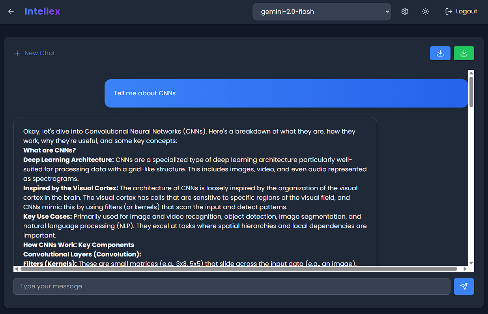

<h1 align="center">🧠🔊🖼️ Intellex</h1>

<p align="center">
  
  
  
  
</p>

<p align="center">
  <em>A futuristic, multimodal conversational AI assistant capable of chatting, understanding images, and transcribing speech.</em><br>
  <strong>Built for flexibility, powered by Gemini, and crafted for seamless user experiences across text, vision, and voice.</strong>
</p>

---

## 🚀 Project Overview

**Intellex** is a unified, AI-powered chatbot that brings together the capabilities of **text-to-text**, **image-to-text**, and **speech-to-text** interactions. Designed with modularity and scalability in mind, Intellex leverages cutting-edge models like **Gemini 1.5 Flash**, **2.0 Flash**, **2.5 Pro**, and more — empowering users with deep insights from visual and spoken data.

> 🏗️ **Current Status:** In active development with continuous enhancements and API integrations.

## 🧑‍💻 Live Demo : https://spontaneous-malabi-8ff709.netlify.app
---

## ✨ Core Modules

### 💬 IntellexChat (Text → Text)
- Intelligent chatbot powered by Gemini for natural conversation.
- Supports multi-model selection and context memory.

### 🖼️ IntellexVis (Image → Text)
- Advanced visual processing capabilities:
  - ✅ Object Detection
  - ✅ Face Recognition
  - ✅ OCR & Text Extraction
  - ✅ Color Analysis
  - ✅ Scene Understanding
  - ✅ Prediction-based Captioning

### 🎙️ IntellexTalk (Speech → Text)
- Converts recorded or real-time speech to text.
- Ideal for dictation, voice-based search, or accessibility features.

---

## 🧠 Model Flexibility

Intellex supports a wide range of Gemini models. Easily switch between them based on use-case:

- 🔹 `gemini-1.5-flash`
- 🔹 `gemini-2.0-flash`
- 🔹 `gemini-1.5-pro`
- 🔹 `gemini-2.5-pro`

Each model comes with its own trade-off between speed and intelligence — configurable per module.

---

## 📸 Screenshots

<p align="center">
  
  
  
</p>

---

## 🛠️ Tech Stack

| Layer             | Technology                                          |
|------------------|-----------------------------------------------------|
| ⚛️ Frontend       | React.js, TailwindCSS / MUI                        |
| 🔍 AI/ML APIs     | Gemini API (multi-version support)                 |
| 🧠 Image Analysis | TensorFlow.js, OpenCV, Tesseract.js, Custom Models |
| 🔊 Speech         | Web Speech API, Whisper (optional)                 |
| 🌐 State Mgmt     | React Context API / Redux                          |
| ⚙️ Dev Tools      | Git, Postman, Firebase, Vite                        |

---

## 🧪 Getting Started

```bash
# Step 1: Clone the repository
git clone https://github.com/PremSaiBollamoni/Intellex.git

# Step 2: Navigate into the project
cd Intellex

# Step 3: Install dependencies
npm install
# or
yarn install

# Step 4: Configure your API Keys
# Create a `.env` file and add:
REACT_APP_GEMINI_API_KEY=your_key_here
REACT_APP_MODEL_VERSION=gemini-1.5-pro

# Step 5: Start the application
npm run dev
# or
yarn dev
```
## 🏆 Achievements

🚀 Built as part of an advanced AI specialization project

🧠 Real-world use cases across multimodal interaction

🥈 IEEE Rapid Innovation Challenge foundation tech stack

## 👨‍💻 Developer : Bollamoni Prem Sai

<p align="center"> <i>“Intellex isn't just a chatbot. It's a vision of how humans and machines will communicate — in text, in sight, and in sound.”</i> </p>

## ⭐ If you love Intellex, don’t forget to star the repo and share it!
